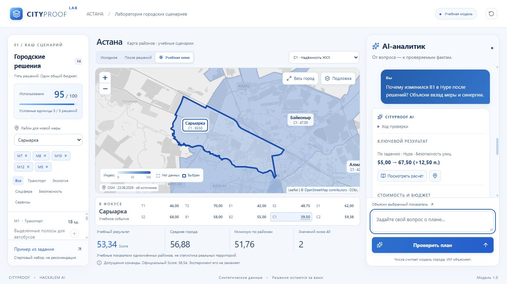
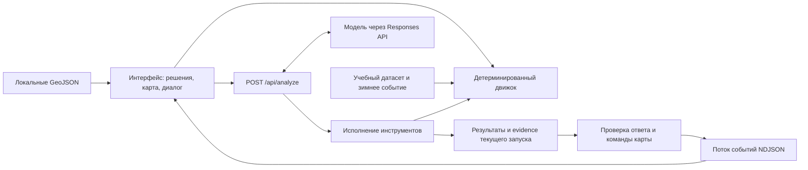

# CITYPROOF

**«Аким на 5 часов» — лаборатория городских сценариев для HackAlem AI.**

## Демо

**Публичная production-версия CITYPROOF:** [Открыть демо](https://cityproof-production.up.railway.app).

CITYPROOF помогает участнику кейса и жюри проверить, что даёт выбранный набор городских мероприятий: укладывается ли он в бюджет, какие показатели меняются и откуда берётся каждое число. Пользователь принимает решения, расчётный движок считает последствия, а AI-агент вызывает инструменты, объясняет результаты и по запросу показывает их на карте Астаны.

Это работающий учебный веб-прототип. Показатели синтетические: приложение не прогнозирует реальную городскую ситуацию и не выбирает городскую политику за пользователя.



## 1. Какую проблему решает проект и для кого

В кейсе нужно выбрать пять мероприятий при ограниченном бюджете. Одной итоговой оценки недостаточно, чтобы понять последствия: меры имеют задержку эффекта, могут быть несовместимы и усиливать друг друга, а улучшение среднего результата не означает улучшения каждого района.

CITYPROOF делает эту проверку наглядной для участников учебного кейса, демонстраторов и жюри: связывает выбранные меры, показатели районов, итоговую оценку и проверяемую арифметику в одном экране. Карта помогает исследовать результат, а агент отвечает на вопросы по фактически выполненным расчётам.

## 2. Что реализовано

- **Конструктор сценария:** каталог из 14 мероприятий по пяти направлениям, выбор районов для локальных мер, бюджет 100 условных единиц и проверка ограничений.
- **Расчёт пяти районов:** десять показателей на район, учёт задержек эффекта, синергий, ограничений значений, весов показателей и долей населения. Недопустимый план не получает итоговый Score.
- **Интерактивная карта Астаны:** шесть районов из сохранённых геоданных OSM, масштабирование, перемещение, наведение, устойчивое выделение, подписи и кнопка «Весь город».
- **Три режима просмотра:** «Исходное», «После решений» и «Учебная зима». Шкала показателей 0–100 едина; отсутствие данных отличается от низкого значения.
- **Один учебный стресс-тест:** отдельный зимний эксперимент с явно указанными допущениями команды, без изменения результата по заданию.
- **Настоящий AI-агент:** произвольный вопрос, вызовы расчётных инструментов, уточняющий вопрос и журнал фактических операций. Заранее подготовленный отчёт не подменяет вызов модели.
- **Показ результата агентом:** по просьбе «Покажи…» агент отправляет проверенную команду карте; выбираются район, показатель, режим и соответствующая запись вычисления.
- **Объяснимость:** кнопка «Посмотреть расчёт» раскрывает исходное значение, эффекты мер, коэффициенты задержки, синергию, сумму и ограничение диапазона.
- **Диалог:** отдельные сообщения пользователя и CITYPROOF AI, живой статус, структурированный ответ и история текущей вкладки. Карточка вычисления находится под картой и не закрывает агента.

Сарайшық показан на карте нейтрально: **«Не входит в учебный набор данных»**. Ему нельзя назначать мероприятия; вымышленные или нулевые показатели ему не присваиваются.

## 3. Как работает решение

1. Пользователь открывает один рабочий экран: слева — решения, в центре — карта, справа — агент.
2. Выбирает ровно пять разных мероприятий и районы для районных мер либо загружает «Пример из задания».
3. Приложение проверяет бюджет, количество мер, направления и несовместимости. Допустимый план сразу получает расчётный результат; его можно исследовать на карте без AI.
4. Пользователь включает или оставляет включённой «Учебную зиму» и задаёт вопрос агенту.
5. Сервер передаёт модели текущий снимок решений, вопрос, выбранный район и показатель. Модель запрашивает необходимые инструменты, а сервер исполняет их и возвращает факты.
6. Агент формирует ссылки на подтверждённые результаты. Сервер проверяет ссылки и сам подставляет численные значения в ответ.
7. Если пользователь просил показать результат, карта плавно переходит к нужному району. «Посмотреть расчёт» раскрывает арифметику; затем можно задать уточняющий вопрос.

### Что именно считает движок

Допустимый план содержит ровно пять разных мероприятий, не больше двух из одного направления и стоит не более 100 единиц. Районные меры требуют район, городские действуют во всех пяти районах и оплачиваются один раз. M1/M3 несовместимы всегда; M4/M7 и M5/M13 — в одном районе.

Для каждой меры эффект умножается на `(8 − lag_quarters) / 8`. Затем прибавляются фиксированные синергии. Значения ограничиваются диапазоном `[0, 100]` после суммирования всех эффектов. Промежуточного округления нет.

```text
Итог района = сумма показателей с весами из датасета
Среднее города = сумма итогов районов с весами долей населения
Score = 0,7 × среднее города + 0,3 × минимальный итог района − Ncrit
Ncrit = число пар «район / показатель» со значением строго ниже 40
```

Остаток бюджета не даёт бонуса. Исходное состояние можно просматривать отдельно, но это не делает пустой план допустимым.

**Учебная зима** (`winter_demo`) берёт копию результата по заданию, уменьшает T1 на 4 пункта и C1 на 8 пунктов во всех пяти районах, ограничивает значения и пересчитывает итоги. Повторный запуск не накапливает воздействие. Коэффициенты заданы командой, не выведены из наблюдений; отдельной защиты мероприятий от зимы нет.

## 4. Технологии

| Часть | Что используется |
|---|---|
| Язык | TypeScript; JavaScript для служебных скриптов |
| Приложение | Next.js 16, App Router, React 19; один Node.js-процесс для интерфейса и серверных обработчиков |
| Интерфейс | Tailwind CSS 4, CSS, Lucide React; светлая бело-синяя тема |
| Карта | Leaflet 1.9, локальные GeoJSON, тайлы OpenStreetMap |
| Проверка данных | Zod 4, строгие схемы запросов и инструментов |
| AI | Официальный OpenAI SDK 7, Responses API, function calling и structured outputs |
| Тестирование | Vitest, Playwright для HTTP-проверок, TypeScript, ESLint |
| Подготовка геоданных | osmtogeojson, Turf, polylabel; используются в скриптах подготовки и проверках |

Зависимости перечислены в [package.json](package.json), разрешённые версии зафиксированы в [package-lock.json](package-lock.json).

**AI-модель не зафиксирована в исходном коде.** Её API-идентификатор задаётся через `OPENAI_MODEL`; в `.env.example` он пустой. Нужна доступная вашему API-аккаунту модель с поддержкой Responses API, инструментов и структурированного ответа. Конкретное имя модели нельзя подтвердить по опубликованной конфигурации. По умолчанию SDK обращается к OpenAI; `OPENAI_BASE_URL` позволяет явно настроить совместимый endpoint, совместимость которого нужно проверять отдельно.

## 5. Архитектура проекта

Одно приложение без отдельного backend-сервиса и базы данных. Одна реализация расчётного движка используется для предварительного результата в интерфейсе, серверных расчётов, инструментов агента и тестов. Сервер повторно проверяет входные данные и не принимает стоимость или коэффициенты, рассчитанные клиентом.



### Основные компоненты

| Файл или каталог | Назначение |
|---|---|
| `src/components/cityproof.tsx` | Основной экран, состояние плана, режимы, запросы агенту и применение событий |
| `src/components/city-map.tsx` | Leaflet-карта, подписи, выбор и подтверждение перехода |
| `src/components/agent-conversation.tsx` | Сообщения, статусы, структурированный ответ и действия |
| `src/components/evidence-panel.tsx` | Раскрытие подтверждённой арифметики |
| `src/lib/model/engine.ts` | Валидация, расчёт, учебная зима, агрегаты и журнал вычислений |
| `src/lib/ai/` | Инструменты, цикл работы модели, проверка объяснений, серверные сессии и история интерфейса |
| `src/lib/map/` | Сопоставление географии и учебных районов, проверка команд показа |
| `src/app/api/` | Серверные обработчики расчёта, зимы и анализа |
| `public/geography/`, `data/geography/` | Готовая геометрия, исходные ответы OSM, metadata, сопоставления и проверки |
| `tests/`, `scripts/` | Автоматические проверки, настоящий API smoke test и подготовка геоданных |

### Серверные API

| Метод и путь | Назначение |
|---|---|
| `POST /api/simulate` | Проверить `decisions`, рассчитать результат и evidence |
| `POST /api/stress` | Рассчитать допустимый план с `event_id` (`none` или `winter_demo`) |
| `GET /api/analyze` | Сообщить наличие серверных настроек AI и установить сессионную cookie; не проверяет доступность модели вызовом |
| `POST /api/analyze` | Принять вопрос и план; вернуть поток реальных операций, результатов, проверенного ответа и команды карты |

### Инструменты агента и проверка ответа

| Инструмент | Действие |
|---|---|
| `get_model_rules` | Получить правила, определения и ограничения модели |
| `evaluate_scenario` | Рассчитать текущий неизменный план |
| `run_stress_test` | Выполнить отдельный учебный эксперимент |
| `get_evidence` | Получить точную арифметику показателя из рассчитанного результата |
| `show_evidence_on_map(evidence_id)` | Отправить браузеру команду показа ранее полученного evidence |

Модель выбирает инструменты и ссылки на факты, но не выполняет арифметику ответа. Сервер проверяет принадлежность результатов текущей сессии и снимку решений, получение evidence и наличие заявленного эффекта. Неподтверждённый ответ возвращается модели на исправление в пределах лимита; при неудаче показывается ошибка.

Район, показатель и режим команды карты извлекаются из evidence, а не из придуманных моделью координат. Автоматический переход допускается по явной просьбе показать результат. Обычное объяснение оставляет ручную кнопку. Браузер отдельно подтверждает завершённый переход; отправка команды не выдаётся за исполнение. Отмена, изменение плана, новый запрос и ручное управление защищают экран от устаревших команд.

## 6. Установка и запуск

### Требования

- Git, Node.js 22.x и npm. Зафиксированная проверенная среда: Node.js **22.23.2**, npm **10.9.8**.
- Для установки зависимостей нужен интернет. Для настоящего агента — серверный API-ключ, доступная модель и API-квота; для картографической подложки — доступ к тайлам OSM.
- Расчёты, учебная зима и локальные полигоны работают без API-ключа. Ответы настоящего агента требуют настроенного API.

### Шаг 1. Получить код текущей версии

```sh
git clone --branch codex/cityproof https://github.com/BAITC-Hacks/hack-8d88351c-eam-trinity.git
cd hack-8d88351c-eam-trinity
npm ci
```

Версия, описанная в README, находится в `codex/cityproof`. Наличие этой ветки не означает слияния в `main`.

### Шаг 2. Настроить настоящего агента

Скопируйте шаблон окружения. В PowerShell:

```powershell
Copy-Item .env.example .env.local
```

В macOS/Linux:

```sh
cp .env.example .env.local
```

Откройте `.env.local` локально и заполните:

| Переменная | Значение |
|---|---|
| `OPENAI_API_KEY` | Ваш серверный API-ключ |
| `OPENAI_MODEL` | API-идентификатор модели, доступной этому ключу |
| `OPENAI_BASE_URL` | Необязательно: адрес согласованного совместимого endpoint; оставьте пустым для OpenAI |

Не отправляйте ключ в чат и не включайте его в Git. `.env.local` исключён через `.gitignore`; ключ используется только на сервере. После изменения окружения перезапустите приложение. Индикатор настройки API не гарантирует доступность провайдера — её проверяет реальный запрос.

### Шаг 3. Запустить приложение

Режим разработки:

```sh
npm run dev
```

Откройте [http://127.0.0.1:3000](http://127.0.0.1:3000).

Для локального запуска production-сборки остановите dev-сервер и выполните:

```sh
npm run build
npm start
```

Если порт 3000 занят, используйте `npm start -- --port 3001` и откройте `http://127.0.0.1:3001`. Скрипты запуска по умолчанию слушают `127.0.0.1`; локальный production-запуск не является публичным размещением.

## 7. Как проверить решение: сценарий для жюри

Для полного сценария нужны настроенный API и доступная квота. Сам расчёт можно повторить без AI.

1. Откройте приложение и нажмите **«Пример из задания»**. Он загружает следующий допустимый набор; это контрольный пример, не рекомендация:

   | Мера | Назначение | Стоимость |
   |---|---|---:|
   | M7 — школа + детсад | Нура | 24 |
   | M8 — центр семейного здоровья / поликлиника | Нура | 20 |
   | M10 — освещение и камеры | Нура | 12 |
   | M12 — цифровая платформа обращений | Весь город | 14 |
   | M5 — перевод частного сектора на чистое топливо | Сарыарка | 25 |

2. Выберите **«После решений»**. Стоимость — **95 из 100**, остаток — **5**, Score — **56,54** в интерфейсе (без округления: `56.54307`).
3. Оставьте включённой **«Учебную зиму»** в панели агента и отправьте:

   > Покажи изменения ЖКХ в Сарыарке после зимнего события и объясни причину.

4. Убедитесь, что вопрос сразу появился сообщением «Вы», затем показались реальные операции. После вызова инструмента карта должна выбрать **Сарыарку**, показатель **C1 — Надёжность ЖКХ** и режим **«Учебная зима»**.
5. В ответе ожидается **47,50 → 39,50**. Нажмите **«Посмотреть расчёт»**: арифметика зимнего шага — `47,5 − 8 = 39,5`. Это изменение относительно результата после решений, а не относительно исходного состояния до мер. Зимний Score — **53,34** (`53.34307`); результат по заданию остаётся отдельным.
6. Задайте уточняющий вопрос:

   > Почему изменился B1 в Нуре после решений? Объясни вклад меры и синергии.

   Ожидаемые факты: **55,00 → 67,50**; эффект M10 — `12 × 0,875 = 10,5`, синергия M10+M12 — `+2`. Это обычное объяснение: автоматического перемещения карты быть не должно. Кнопка расчёта позволяет открыть соответствующее evidence вручную.
7. Выберите на карте **Сарайшық**: вместо чужих показателей должно появиться сообщение об отсутствии учебных данных. Удалите одно мероприятие: при четырёх решениях расчёт сценария и запуск анализа недоступны. Прежние ответы остаются в истории с отметкой о старом снимке, их кнопки расчёта отключены.

Текст ответа и порядок инструментальных вызовов могут различаться между запусками модели. Контрольные значения рассчитываются детерминированно и должны совпадать.

### Автоматические проверки

Из корня проекта:

```sh
npm test
npm run typecheck
npm run lint
npm run build
```

Для HTTP-проверок сначала запустите приложение, затем в другом терминале:

```sh
npm run test:e2e
```

Для проверки **настоящего** API через работающий сервер:

```sh
npm run test:agent
```

Последняя команда расходует API-квоту. Она проверяет расчёт, зиму, evidence, команду показа и уточняющий вопрос. Без настроенного серверного API завершается с кодом 2 и сообщением `BLOCKED`; недоступный провайдер не подменяется тестовым ответом.

Оба сценария используют порт 3000 по умолчанию. Для другого порта задайте `CITYPROOF_TEST_URL`, например в PowerShell:

```powershell
$env:CITYPROOF_TEST_URL = 'http://127.0.0.1:3001'
npm run test:e2e
npm run test:agent
```

В macOS/Linux переменную можно передать перед командой: `CITYPROOF_TEST_URL=http://127.0.0.1:3001 npm run test:e2e` (аналогично для `test:agent`).

`npm test` проверяет ядро, ограничения, evidence, сессии, геоданные, команды карты и историю диалога. Агентные unit-тесты используют тестовый транспорт. Несмотря на имя `test:e2e`, текущие Playwright-тесты проверяют HTTP API, а не браузерный интерфейс. `test:agent` подтверждает серверный поток, но фактическое перемещение карты нужно проверить в браузере по сценарию выше.

В [STATUS.md](STATUS.md) за 23.09.2026 зафиксированы 78 пройденных тестов, 7 HTTP-проверок, typecheck, lint, production build, настоящий API и браузерная проверка на экране 1366×768. Это запись выполненной проверки, а не гарантия доступности внешнего API в любой последующий момент.

Проверка отказа подложки: запустите production на порту 3001, затем `node scripts/qa-no-tiles.mjs` и откройте `http://127.0.0.1:3002`. QA-прокси блокирует внешние изображения через CSP. Локальные полигоны, подписи, выбор районов и расчёты должны остаться доступны с сообщением о незагрузившейся подложке.

## 8. Данные и интеграции

| Источник | Использование |
|---|---|
| [sources/](sources/) | Исходные PDF и DOCX кейса, датасета и правил участия |
| [hackalem_model.json](hackalem_model.json) | Производная датасета организаторов: пять районов, десять показателей, 14 мер, веса, ограничения, синергии и контрольные значения |
| [DATA_CHECK.json](DATA_CHECK.json) | Проверка переноса исходных таблиц и арифметики при подготовке данных; не заменяет тесты приложения |
| [stress_events.json](stress_events.json) | Отдельные демонстрационные допущения команды для `winter_demo` |
| [data/geography/](data/geography/) | Исходные OSM relations, версии, дата получения, лицензия, сохранённый запрос Overpass, сопоставления и отчёт валидации |
| [public/geography/](public/geography/) | Готовые GeoJSON города и районов, используемые приложением без повторной выгрузки геометрии |
| OpenAI Responses API | Работа модели: вопрос, учебный план, контекст и результаты инструментов передаются настроенному провайдеру с сервера |
| OpenStreetMap tiles | Фоновая карта загружается браузером с `tile.openstreetmap.org`; атрибуция сохраняется |

Геометрия получена через **OSM API 23 сентября 2026 года**, лицензия **ODbL 1.0**, © OpenStreetMap contributors. Фактическая выгрузка выполнена через OSM API после ошибок/тайм-аутов Overpass; эквивалентный запрос сохранён для воспроизводимости. При открытии приложения Overpass не вызывается, стандартные тайлы массово не скачиваются и не архивируются для офлайн-режима.

Районы Есиль, Алматы, Сарыарка, Байконыр и Нура связаны с неизменными ID модели через явный справочник [district-mapping.json](data/geography/district-mapping.json); Сарайшық имеет `modelDistrictId: null`. Связь одноимённых районов с учебными показателями **не является утверждением о реальной статистике этих территорий**.

Происхождение, версии исходных объектов, правовые и географические ограничения подробно описаны в [README геоданных](data/geography/README.md). Для обычного запуска повторная подготовка не требуется. `npm run geo:prepare` воспроизводит GeoJSON из сохранённых локальных источников; `npm run geo:fetch` обращается к сети и обновляет исходные данные, поэтому это отдельная операция с обязательной проверкой изменений.

## 9. Ограничения текущей версии

- **Учебная модель:** синтетические показатели, условный бюджет, фиксированные эффекты и один зимний эксперимент. Нет реальных прогнозов, вероятностей событий, адресных или поквартальных расчётов. На улицы и отдельные здания районные показатели не переносятся.
- **Трактовка правил:** краткое ТЗ перечисляет пять направлений, подробный датасет допускает не более двух мер на направление. Реализована последняя трактовка: минимум три направления, без обязательного покрытия всех пяти. Подтверждённого разъяснения ментора в репозитории нет.
- **Границы OSM не официально заверены.** Их соответствие официальным изменениям августа 2026 не подтверждено. Южный участок городской геометрии около **10,995 км²** отсутствует в шести районных relations: показывается отдельным контуром и не присвоен произвольному району. Дата выгрузки не доказывает юридическую актуальность.
- **Зависимость AI от провайдера:** нужны API-доступ, поддерживаемая модель, сеть и квота. На вопрос отведено до 45 секунд, не более 6 обращений к модели и 8 вызовов инструментов. Ошибки и неполные ответы показываются явно.
- **Демонстрационный сервер:** сессии находятся в памяти одного процесса, срок жизни — 20 минут с продлением при запросах. Для уточнений модели передаются последние две пары «вопрос — ответ» и доступные факты запуска. Перезапуск сервера сбрасывает контекст.
- **Лимиты запросов:** до двух одновременных анализов, до 6 запросов в минуту на сессию и 20 на процесс. Это не полноценная система защиты публичного сервиса от расходов.
- **История не равна сохранённому проекту:** диалог хранится в `sessionStorage` текущей вкладки. После обновления страницы прежние сообщения доступны для чтения, но их кнопки evidence отключены; план нужно выбрать заново и запустить новый анализ. Базы данных и постоянного хранения сценариев нет.
- **Свободные формулировки:** автоматический показ зависит от распознанного намерения. Если формулировка неоднозначна, можно явно написать «Покажи» или воспользоваться кнопкой ответа.
- **Не реализованы:** авторизация, A/B-сравнение сохранённых вариантов, экспорт, оптимизатор, новые кризисы, мобильное приложение, дополнительные страницы и 3D. Публичное многопользовательское развёртывание не подтверждено.

## 10. Развёрнутая версия и репозиторий

**Подтверждённой ссылки на публично развёрнутую версию в текущем репозитории нет.** Проверенный способ демонстрации — локальный запуск по инструкции выше. `http://127.0.0.1:3000` и `http://127.0.0.1:3001` являются локальными адресами, а не deployed-версией.

- Командный репозиторий: [BAITC-Hacks/hack-8d88351c-eam-trinity](https://github.com/BAITC-Hacks/hack-8d88351c-eam-trinity).
- Рабочая версия: [ветка codex/cityproof](https://github.com/BAITC-Hacks/hack-8d88351c-eam-trinity/tree/codex/cityproof).
- Выполненные проверки и состояние проекта: [STATUS.md](STATUS.md).
